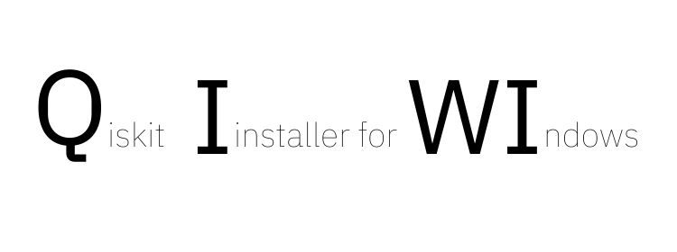

<div align="center">
  <h1 align="center">Qiskit Installer for Windows</h1>
  <h3 align="center">This installer will set up Qiskit and a local copy of VSCode on your computer, with a ready-to-use Python virtual environment for Jupyter notebooks.</h3>
</div>

<div align="center">

  <!-- PROJECT LOGO -->
  <br />
    
  
    
  <br />
</div>


# ⚠️ Important notice before installing  

- Only install software on a computer that is not production-level or mission-critical to you. (This is a general truth that does not pertain only to this installer.)

- If the installation fails: Create a fresh user account and log in under this account to install Qiskit.This will help insulate your Qiskit SDK from other software you may have installed on your computer. This is particularly important if your computer already has a complicated installation history of software frameworks.

## 💥 QuickStart / Installation

### 🏃 Running the script !   

- **METHOD 1** (Recommended): Download and execute the [qiskit_installer.exe](https://github.com/ket-q/qiskit_windows_installer_pub/raw/refs/heads/main/qiskit_installer.exe)
*An executable file is generated for you, but the script is availabe if you want to check it before running it*

  
- **METHOD 2** : Run script with powershell:

  &nbsp;&nbsp;&nbsp;&nbsp;&nbsp;&nbsp;&nbsp;&nbsp;&nbsp;&nbsp;&nbsp;&nbsp;**Step 1.1** Download the script qiskit_installer.ps1
  
  &nbsp;&nbsp;&nbsp;&nbsp;&nbsp;&nbsp;&nbsp;&nbsp;&nbsp;&nbsp;&nbsp;&nbsp;**Step 1.2** Open a powershell console and navigate to the qiksit_installer.ps1 download file.\
  &nbsp;\
  &nbsp;&nbsp;&nbsp;&nbsp;&nbsp;&nbsp;&nbsp;&nbsp;&nbsp;&nbsp;&nbsp;&nbsp;*Usually, when opening a powershell you will be placed at the user root and you need to go to the Downloads 
  &nbsp;&nbsp;&nbsp;&nbsp;&nbsp;&nbsp;&nbsp;&nbsp;&nbsp;&nbsp;&nbsp;&nbsp;folder (or any other folder where you downloaded the script)*
  
  ```powershell
      cd .\Downloads
  ```
  
  &nbsp;&nbsp;&nbsp;&nbsp;&nbsp;&nbsp;&nbsp;&nbsp;&nbsp;&nbsp;&nbsp;&nbsp;**Step 1.3** Execute this command 
  ```powershell
      Set-ExecutionPolicy Bypass -Scope Process -Force && .\qiskit_installer.ps1

  ```

---


### 🚶 Step by step guide (after running/executing the script  

#### Step 1️⃣: Accept the licences when the window opens


#### Step 2️⃣: Wait for the downloading of the packages and the opening of Visual Studio Code

Visual studio code will automaticaly open with a jupyter notebook to setup your qiskit account

#### Step 3️⃣: Follow the instructions of the notebook

You can also download the setup [notebook](https://raw.githubusercontent.com/ket-q/qiskit_windows_installer_pub/refs/heads/main/notebooks/IBM_account_setup.ipynb) manually.

#### Step 4️⃣ (Optional): We recommended to save this setup notebook in your quantum working folder


## ✏️ Usage 

### 🚩 You need to will to select the correct kernel/interpreter for every new file using Qiskit:  🚩 

---

### With any Jupyter Notebook:


1. Click "Select Kernel" on the top right
2. Click "Python Environnements"
3. Click "qiskit"

### With Non-Jupyter Notebook (Python or Python based):

1. Open the command palette (Ctrl + Shift + P)
2. Select "Python : select interpreter"
3. Select our qiskit environnement "Python 3.* (Qiskit 1.*)"

You can now run Qiskit on Windows.


## 🔌 Technical informations 


### Qiskit Windows installer

The installer itself does not stay resident in the system as it stay isolated sinde your %appdata% to prevent any conflict from happenning.


## ❓ FAQ / SUPPORT / TROUBLESHOOTING


## 📜 License

[License of this installer](https://github.com/ket-q/qiskit_windows_installer_pub/blob/main/LICENSE)

During the installation, you are required to accept mutilple licences:
- [Visual studio code](https://code.visualstudio.com/license)
- [Qiskit](https://github.com/Qiskit/qiskit/blob/main/LICENSE.txt)
- [Python](https://docs.python.org/3/license.html#terms-and-conditions-for-accessing-or-otherwise-using-python)
- [Pyenv-win](https://pyenv-win.github.io/pyenv-win/#license-and-copyright)


