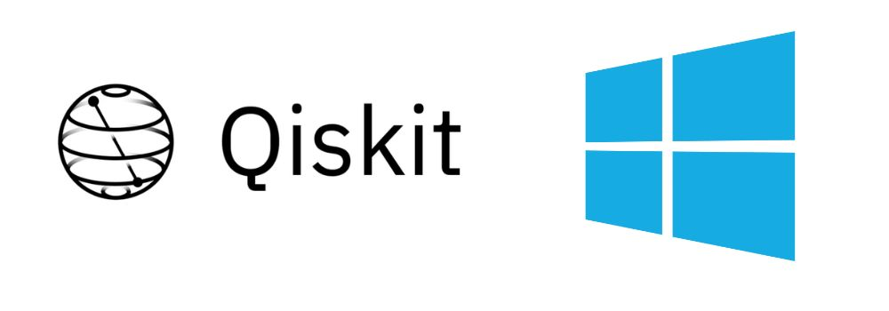

<div align="center">
  <h1 align="center">Qiskit Installer for Windows</h1>
  <h3 align="center">This installer will set up Qiskit and a local copy of VSCode on your computer, with a ready-to-use Python virtual environment for Jupyter notebooks.</h3>
</div>

<div align="center">

  <!-- PROJECT LOGO -->
  <br />
    
  
    
  <br />
</div>

##  🔍 Overview 

This installer will set up Qiskit and a local copy of VSCode on your computer, with a ready-to-use Python virtual environment for Jupyter notebooks.

## ⚠️ Important notice before installing  

- Only install software on a computer that is not production-level or mission-critical to you. (This is a general truth that does not pertain only to this installer.)
- Create a fresh user account and log in under this account to install Qiskit ([link instructions on how to create a new user, perhaps we need to create our own video])
- This will help insulate your Qiskit SDK from other software you may have installed on your computer.
- This is particularly important if your computer already has a complicated installation history of software frameworks.

## 💥 QuickStart / Installation 


### Step 1 (FIRST METHOD) Download and execute the [qiskit_installer.exe](https://github.com/ket-q/qiskit_windows_installer_pub/raw/refs/heads/main/qiskit_installer.exe)
*An executable file is generated for you, but the script is availabe if you want to check it before running it*

Download and execute our [Qiskit Windows Installer](https://github.com/ket-q/qiskit_windows_installer_pub/raw/refs/heads/main/qiskit_installer.exe)

  
### Step 1 (SECOND METHOD) Run script with powershell:

  &nbsp;&nbsp;&nbsp;&nbsp;&nbsp;&nbsp;**Step 1.1** Download the script qiskit_installer.ps1
  
  &nbsp;&nbsp;&nbsp;&nbsp;&nbsp;&nbsp;**Step 1.2** Open a powershell console and navigate to the qiksit_installer.ps1 download file
  
  
  &nbsp;&nbsp;&nbsp;&nbsp;&nbsp;&nbsp;**Step 1.3** Execute this command (it allows to run the script)
  ```powershell
  Set-ExecutionPolicy Bypass -Scope Process -Force
  ```
  &nbsp;&nbsp;&nbsp;&nbsp;&nbsp;&nbsp;**Step 1.4** Execute the script with the command
  ```powershell
  .\qiskit_installer.ps1
  ```

### Step 2: Accept the licences when the window opens

image of the window ! (GIF accepting the licenses)

### Step 3: Wait for the downloading of the packages

Image of the installation done !

Visual studio code will automaticaly open with a jupyter notebook to setup your qiskit account

### Step 4: Follow the instructions of the notebook

You can also download the setup [notebook](https://raw.githubusercontent.com/ket-q/qiskit_windows_installer_pub/refs/heads/main/notebooks/IBM_account_setup.ipynb) manually.

### Step 5 (Optional): We recommended to save this setup notebook in your quantum working folder


## ✏️ Usage 

### This insaller creates a private environnement with Qiskit to avoid any conflicts.

To use this properly, you need to select the correct interpreter when running your script. 

With VS Code (for Python or Jupyter):
1. Open the command palette (Ctrl + Shift + P)
2. Select "Python : select interpreter"
3. Select our qiskit environnement "Python 3.* (Qiskit 1.*)"

PUT A GIF TO SHOW THIS

You can now run Qiskit on Windows.


## ❓ FAQ / SUPPORT


## 📜 License

[License of this installer](https://github.com/ket-q/qiskit_windows_installer_pub/blob/main/LICENSE)

During the installation, you are required to accept mutilple licences:
- [Visual studio code](https://code.visualstudio.com/license)
- [Qiskit](https://github.com/Qiskit/qiskit/blob/main/LICENSE.txt)
- [Python](https://docs.python.org/3/license.html#terms-and-conditions-for-accessing-or-otherwise-using-python)
- [Pyenv-win](https://pyenv-win.github.io/pyenv-win/#license-and-copyright)


## 🔌 Technical details 


### Qiskit Windows installer

The installer itself does not stay resident in the system as it stay isolated sinde your %appdata% to prevent any conflict from happenning.

### Pipenv
[Pipenv](https://pipenv.pypa.io/en/latest/) is a tool to manage Python virtual environments and their software packages, and to facilitate packaging of packages present in a virtual environment.
It is capable of `dependency resolution`, which makes sure that all package dependencies are met. An introductions to Pipenv is from RealPython ([link](https://realpython.com/pipenv-guide/)), more advanced usage is described on the Pipenv website ([link](https://docs.pipenv.org/advanced/#configuration-with-environment-variables)).
* A major advantage of Pipenv over the newer tool [Poetry](https://python-poetry.org/) is that Pipenv puts its venvs below the `~.virtualenvs` folder in the user's homedirectory, from where VSCode reliably picks it up. This is considerable benefit with novice users to be able to select their Python environment that hosts the Jupyter server. Poetry creates its environments in a different place. In principle, the Python plugin of VSCode claims to spot virtual environments created by Poetry ([link](https://code.visualstudio.com/docs/python/environments#_where-the-extension-looks-for-environments)), but in practice it only worked by setting the `python.venvPath` (at least on Windows 10).
#### Creating a venv that contains all necessary packages
Create a project directory, enter it, and create a virtual environment if one
does not already exist for that given directory (recall, all venvs are created
under `~.virtualenvs` and the path to the folder is encoded and added to the
venv name, e.g., )
```bash
mkdir pipenv-demo
cd pipenv-demo
pipenv shell --python 3.12
```
#### Further useful Pipenv commands
Purging a venv created by Pipenv. This will remove the venv under `~.virtualenvs`. You can then re-create it there (from the same folder), if you choose.
```bash
cd pipenv-demo
pipenv --rm
```

### Windows
* Placement of app-specific data on the Windows OS ([link](https://gist.github.com/ryangoree/67c26bad170f299eec43622038b79512)).
### VS Code
* Manually specifying a Python interpreter ([link](https://code.visualstudio.com/docs/python/environments#_manually-specify-an-interpreter
)).
### Python
#### Python virtual environments
* Installation of the IPython kernel, which is the Python execution backend for Jupyter ([link](https://ipython.readthedocs.io/en/stable/install/kernel_install.html)).
### Powershell
* `Invoke-Command` vs. call operator `&` ([link](https://stackoverflow.com/questions/68727495/start-process-invoke-command-or))
* `Invoke-Command` etc. command invocation and variable expansion ([link1](https://stackoverflow.com/questions/60979858/powershell-invoke-command-with-filepath-on-local-computer-vague-parameters-err/60980641#60980641), [link2](https://stackoverflow.com/questions/57677186/how-do-i-do-the-bash-equivalent-of-progpath-program-in-powershell/57678081#57678081])).
* Command invocation and script blocks ([MS link](https://learn.microsoft.com/en-us/powershell/module/microsoft.powershell.core/about/about_script_blocks?view=powershell-7.5)).
#### Line continuation (avoiding the backtick `)
* Long-line continuation and splatting ([link](https://stackoverflow.com/questions/2608144/how-to-split-long-commands-over-multiple-lines-in-powershell)).
* Blog on line continuation ([link](https://get-powershellblog.blogspot.com/2017/07/bye-bye-backtick-natural-line.html)).
#### Other
* Self-elevation of Powershell script ([link](https://stackoverflow.com/questions/60209449/how-to-elevate-a-powershell-script-from-within-a-script)).
* Run Powershell script through Windows installer ([link](https://stackoverflow.com/questions/46221983/how-can-i-use-powershell-to-run-through-an-installer)).
### Related projects
* windows-dev-box-setup-scripts ([link](https://github.com/Microsoft/windows-dev-box-setup-scripts?tab=readme-ov-file)).
* SO discussion ([link](https://stackoverflow.com/questions/48144104/powershell-script-to-install-chocolatey-and-a-list-of-packages)).
### Poetry
* Step-by-step installation ([link](https://gist.github.com/Isfhan/b8b104c8095d8475eb377230300de9b0)).
* Official instructions ([link](https://python-poetry.org/docs/#installing-with-the-official-installer)).

## 
