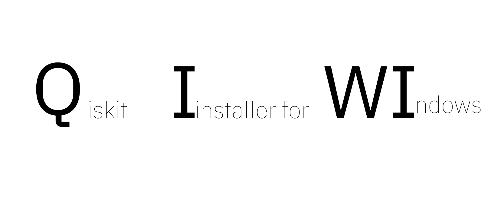

<div align="center">
  <h1 align="center">Qiskit Installer for WIndows</h1>
</div>

<div align="center">

  <!-- PROJECT LOGO -->
  <br />
    
  
    
  <br />
</div>

##  📍 What is QIWI ?

QIWI is a QIskit Windows installer will set up Qiskit and a local copy of VSCode on your computer, with a ready-to-use Python virtual environment for Jupyter notebooks.

<br />

## ⚠️ Important notice before installing  

- Only install software on a computer that is not production-level or mission-critical to you. (This is a general truth that does not pertain only to this installer.)

- If the installation fails: Create a fresh user account ([tutorial video for it](https://www.youtube.com/watch?v=LpPZ1oBjsnM)) and log in under this account to install Qiskit. This will help insulate your Qiskit SDK from other software you may have installed on your computer. This is particularly important if your computer already has a complicated installation history of software frameworks.

<br />


## 💥 Installation

### 🏃 Running the script!   

- **Method 1** (recommended if you're ok with downloading and executing an executable on your computer): Download and execute the [qiskit_installer.exe](https://github.com/ket-q/qiskit_windows_installer_pub/raw/refs/heads/main/qiskit_installer.exe)


  
- **Method 2** (if you want visibility into what you will execute) : Run script with powershell:

  &nbsp;&nbsp;&nbsp;&nbsp;&nbsp;&nbsp;&nbsp;&nbsp;&nbsp;&nbsp;&nbsp;&nbsp; **- Step 1**: Download the script qiskit_installer.ps1
  
  &nbsp;&nbsp;&nbsp;&nbsp;&nbsp;&nbsp;&nbsp;&nbsp;&nbsp;&nbsp;&nbsp;&nbsp; **- Step 2**: Open a powershell console and navigate to the qiksit_installer.ps1 download file.\
  &nbsp;\
  &nbsp;&nbsp;&nbsp;&nbsp;&nbsp;&nbsp;&nbsp;&nbsp;&nbsp;&nbsp;&nbsp;&nbsp;*Usually, when opening a powershell you will be placed at the user root and you need to go to the Downloads 
  &nbsp;&nbsp;&nbsp;&nbsp;&nbsp;&nbsp;&nbsp;&nbsp;&nbsp;&nbsp;&nbsp;&nbsp;folder (or any other folder where you downloaded the script)*
  
  ```powershell
      cd .\Downloads
  ```
  
  &nbsp;&nbsp;&nbsp;&nbsp;&nbsp;&nbsp;&nbsp;&nbsp;&nbsp;&nbsp;&nbsp;&nbsp;**Step 3** Execute this command 
  ```powershell
      Set-ExecutionPolicy Bypass -Scope Process -Force && .\qiskit_installer.ps1

  ```

---


### 🚶 Step-by-step guide through the installation process: 

#### Step 1️⃣: Accept the license agreements in the pop-up window


#### Step 2️⃣: Wait for the downloading of the packages and the opening of VS Code

Visual studio code will automaticaly open with a Jupyter notebook to setup your Qiskit account

#### Step 3️⃣: Step 3: Follow the step-by-step guide to run Jupyter notebooks and get you started on the IBM Quantum Platform. 

This setup notebok includes:
- Selecting a Python interpreter for your Jupyter notebook
- Adding your IBM Quantum API token to your Qiskit installation 


*You can also download the [notebook](https://raw.githubusercontent.com/ket-q/qiskit_windows_installer_pub/refs/heads/main/notebooks/IBM_account_setup.ipynb) setup manually.*

#### Step 4️⃣ (Optional): We recommended to save this setup notebook in a folder where you keep your quantum computing projects

<br />


## ✏️ Usage 

### 🚩 You need to will to select the correct kernel/interpreter for every new file using Qiskit:  🚩 

---

### With any Jupyter Notebook:


1. Click "Select Kernel" on the top right
2. Click "Python Environnements"
3. Click "qiskit"

### With Non-Jupyter Notebook (Python or Python based):

1. Open the command palette (Ctrl + Shift + P)
2. Select "Python : select interpreter"
3. Select our qiskit environnement "Python 3.* (Qiskit 1.*)"

You can now run Qiskit on Windows.


## 🔌 Technical informations 


### Qiskit Windows installer

The installer itself does not stay resident in the system as it stay isolated sinde your %appdata% to prevent any conflict from happenning.


## ❓ FAQ / SUPPORT / TROUBLESHOOTING


## 📜 License

[License of this installer](https://github.com/ket-q/qiskit_windows_installer_pub/blob/main/LICENSE)

During the installation, you are required to accept mutilple licences:
- [Visual studio code](https://code.visualstudio.com/license)
- [Qiskit](https://github.com/Qiskit/qiskit/blob/main/LICENSE.txt)
- [Python](https://docs.python.org/3/license.html#terms-and-conditions-for-accessing-or-otherwise-using-python)
- [Pyenv-win](https://pyenv-win.github.io/pyenv-win/#license-and-copyright)


